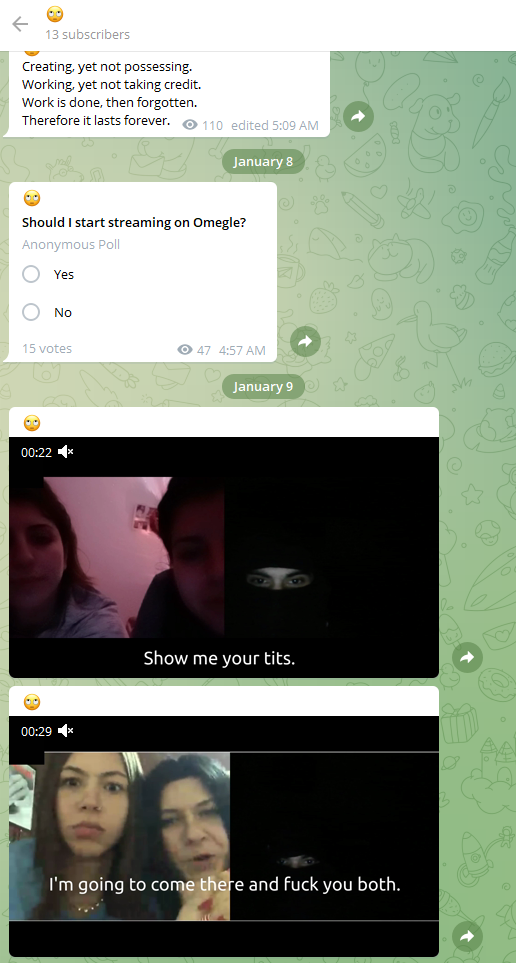
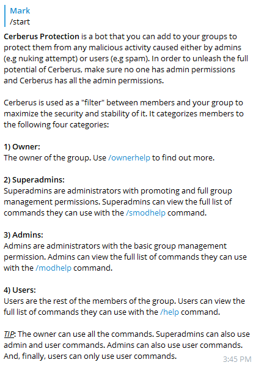
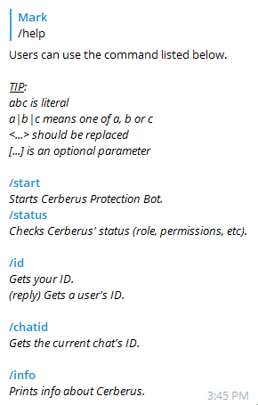
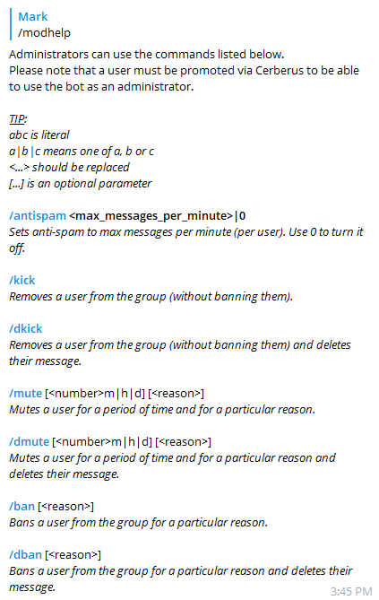
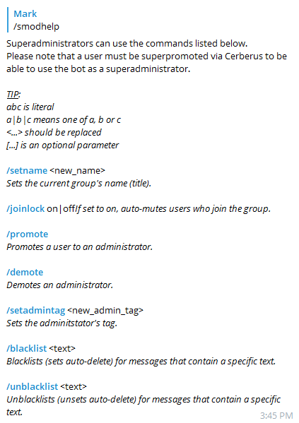

The following blog post outlines some of the reasons I generally advise against choosing [Cerberus](https://t.me/cerberus_protection_bot) as your Telegram group management bot.

This article is based on version __*0.3.0*__ of *Cerberus Protection Bot*.

<!--truncate-->

### Trust

The Cerberus maintainer is a rather sketchy figure.  
Not only does he refuse any type of code audit, he has also previously been caught attempting to subvert a rival Telegram group (oh the joys of [__/pol/__](https://en.wikipedia.org/wiki//pol/) Telegram clones) by trying to pit their admins against each other and slowly banning users from these groups. A practice generally known as __nuking__.

Since the development process is entirely closed and everything happens in private   (as opposed to [Rose](https://missrose.org/), which is closed source but has a documented development process, a [changelog](https://t.me/s/MarieNews) and a [blog](https://pnvlarsen.me/projects/)), nobody but its sole developer can be sure what direction is being taken, what design principles are being followed, redefined or outright ignored, or if any exploits are known.

Furthermore, I've personally witnessed the author of Cerberus write FROM his bot. 
This is not well known — nor communicated, for obvious reasons — but possible through the use of a 3rd party Telegram client like [BGram](https://play.google.com/store/apps/details?id=org.telegram.BifToGram&hl=en&gl=US). 
__(link provided solely for research purposes. I do NOT endorse the use of this product.)__

Lastly, his general attitude towards end users means that anybody using Cerberus is left to their own devices. 
No public support channels exist, and the documentation itself is rather sparse, technical and geared towards programmers rather
than the average Joe.

The bot is linking to the author's personal Telegram channel, which provides no valuable insights but instead promotes his Omegle.

    
Screenshot

### Incomplete documentation

As already outlined in the previous paragraph, Cerberus' documentation is overall shoddy and incomplete.

The __/help__ commands (there are several, since the author has chosen to separate them based on user scope) display a long, monotone list. 
There is no way to query help files for specific commands. Instead everything is presented vertically.

The __/start__ command doesn't limit itself to the bare essentials of using and exploring the bot, instead bludgeoning the user with a wall of text.

The __/ownerhelp__ command doesn't appear to work, at all.  
Neither in groups nor direct DMs to the bot have I nor others ever managed to coax the bot into returning any information.

Documentation for some of the more useful commands is wholly missing. 
The bot supports *ads* which are displayed every n-hours. 
Aside of the developer himself, nobody seems to be aware of its usage. 
Maybe there is no command and the ads are entered directly into a database
by the sole maintainer?

The UI is cluttered and doesn't take advantage of basic Telegram bot features.  
Inline buttons are wholly missing and a (very basic) command list was only added after my outspoken criticism.

    
/start

    
/help

    
/modhelp

    
/smodhelp

### Architectural choices

One of the things (the author of Cerberus names this as one of its outstanding features) that separates the bot from its contenders
is that it doesn't follow the tried and proved Telegram permission model, instead opting for an internal permission model of the author's own design.

The sparse documentation prompts the group owner to give Cerberus full permission and only promote other admins through Cerberus' __/promote__ and __/superpromote__ commands. 
On closer examination, this leads to all admin permissions being managed internally by Cerberus.

As far as Telegram is concerned,  
all admins promoted by Cerberus (admins or "superadmins" — as Cerberus defines admins that can demote and, consequently, ban other admins) have the same two basic permissions set in the Telegram UI. "Change group info" and "Pin messages".  
It is thus clear that Cerberus violates the existing permission model and instead opts to implement its own, largely undocumented, cruft.

With the aforementioned in mind, I've also been informed by multiple sources that they're unable to remove group members that are not even clearly identified as admins.

### Uncertain status

The author of Cerberus failed to enclose what stage of the software development life cycle his bot is actually in. 
Nothing suggests that the bot is production ready, but nothing suggests that it's still in alpha or beta either.

Features are added in secret, at random intervals. Often without even incrementing the version number.
The bot is taken offline for maintenance or due to an issue without prior notice.

Combined with the lack of support, this leaves the user wondering whether Cerberus has not already reached
End-of-life or, at best, a maintenance stage.

### Closed source

As a major proponent of [FOSS](https://en.wikipedia.org/wiki/Free_and_open-source_software) software,  I generally advise against the use of closed source or proprietary software products.

Closed source software, especially when produced by a small group of people or a single developer, seldom provides a coherent support experience. 
One of the strengths of free- and open-source software lies in its inherent capability to create communities and produce coherent documentation and other forms of community service.

[@PuddingBot](https://t.me/puddingbot) is and will remain completely free (as in freedom AND free beer) and open-source. 
As the author and maintainer of @PuddingBot I pledge to keep sensible data safe and handled with utmost care.

The full and unabridged [@PuddingBot source code can be found on GitHub](https://github.com/PuddingBot/pudding-bot).