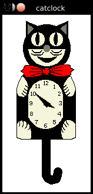
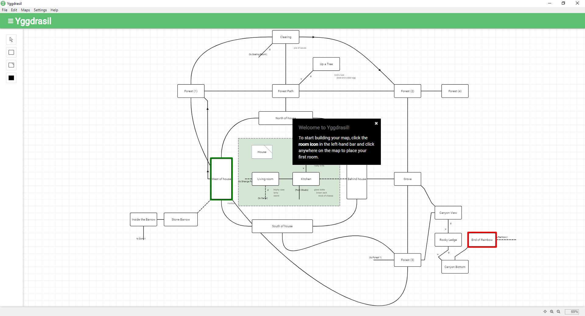
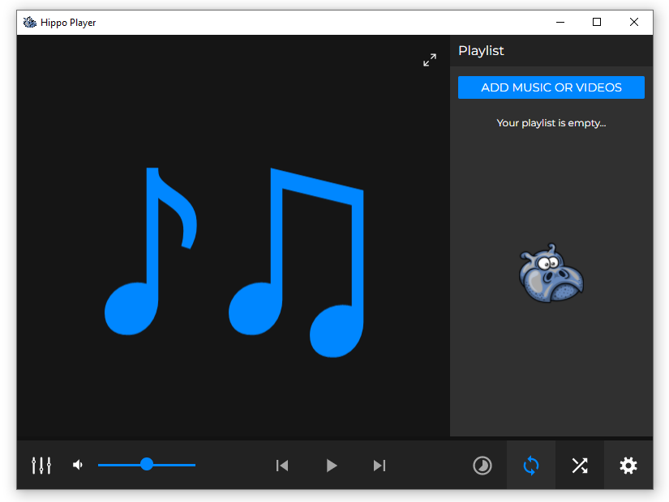
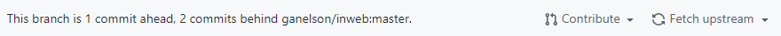

I've recently gotten back into forking (more precisely, hard forking) multiple projects on GitHub.

This can, undeniably, pose a fun experience of which I'd like to give some short examples as well as the reasoning behind the fork.

<!--truncate-->

### [NeoCatclock](https://github.com/Happy-Ferret/neocatclock)

[__NeoCatclock__](https://github.com/Happy-Ferret/neocatclock) is a fork of the venerable [catclock](https://github.com/BarkyTheDog/catclock) by __BarkyTheDog__ which itself is a slight
update from the X10 original to work on modern X11 *nix systems. <br/>

To better understand the code, I condensed the original by removing the *digital* and *analog* modes <br/>
and, finally, the mode code itself. <br/>
This alone saved me about 950 lines of code. <br/>

The current process makes me study the GTK3+ documentation in-depth, <br/> 
as the ultimate goal is to port __catclock__ from [Motif](https://motif.ics.com/) to [GTK](https://www.gtk.org/) to make it portable. <br/>

Eventually, I plan on rewriting the application in Go, using my [CoreGraphics](https://github.com/Anima-OS/CoreGraphics) framework <br/>
I originally wrote for Anima OS but now plan on bringing to all modern desktop platforms.



### [Yggdrasil](https://github.com/middangeard-fiction/yggdrasil)

[__Yggdrasil__](https://github.com/middangeard-fiction/yggdrasil) is a fork of [trizbort.io](https://github.com/henck/trizbort) <br/>
which itself is a re-implementation of [trizbort](https://github.com/JasonLautzenheiser/trizbort), porting the latter from C# to the web.

__Yggdrasil__ contains [two fixes](https://github.com/henck/trizbort/commits?author=Happy-Ferret) that have since been upstreamed. <br/>

What separates my fork from the original project is that I turned the web app into a desktop app <br/>
while also adding translation support. <br/>
Finally, my fork contains an exporter for my own __Middangeard__ engine.

I have not actively worked on the project since 2019 but intend to revive it very soon, <br/>
just as I'm reviving [__Middangeard__](https://github.com/middangeard-fiction/middangeard) itself.



### [Hippo Player Next](https://github.com/Happy-Ferret/hippo-next) (Working Title)

[__Hippo Player Next__](https://github.com/Happy-Ferret/hippo-next) (*will probably be renamed to something else, to establish an original persona*) <br/>
is a fork of [media-player](https://github.com/nt1m/media-player) that removes both the Electron and the web app part <br/>
to focus solely on the desktop.

To achieve this desktop transformation, my fork utilizes [go-astilectron](https://github.com/asticode/go-astilectron), <br/>
a modern Electron binding to Go that uses a TCP socket as an IPC mechanism between the <br/>
Go application and the Electron renderer.

In order to better facilitate __go-astilectron__, <br/>
I upstreamed [changes](https://github.com/asticode/go-astilectron/pull/361) that enable more fine grained window control <br/>
without having to fall back on the [Electron Remote](https://www.npmjs.com/package/@electron/remote) module, <br/>
which can normally be used inside __go-astilectron__ like the following <br/>
(if, like me, you're utilizing [go-astilectron-bootstrap](https://github.com/asticode/go-astilectron-bootstrap))

<details>
    <summary>Code</summary>

```go
Windows: []*bootstrap.Window{{
			Homepage:       "index.html",
			MessageHandler: desktop.HandleMessages,
			Options: &astilectron.WindowOptions{
				BackgroundColor: astikit.StrPtr("#333"),
				Center:          astikit.BoolPtr(true),
				Width:           astikit.IntPtr(800),
				Height:          astikit.IntPtr(600),
				WebPreferences: &astilectron.WebPreferences{
					EnableRemoteModule: astikit.BoolPtr(true),
				},
			},
		}},
```

</details>

Instead of the above and writing windowing code in JS, a window can now be set as __`Always on Top`__ <br/>
by accessing the `astilectron.Window` struct and calling `SetAlwaysOnTop(enable)` on it.

I also removed the CSD (Client Side Decorations) of the original Electron implementation <br/>
in favor of re-using the OS' own window decorations.

Once baseline media support (which is utterly broken upstream) is established <br/>
and the app uses a proper SQLite database to save playlists, <br/>
I plan on adding support for classic MOD files and better support for theming.



### [ScummC](https://github.com/Happy-Ferret/scummc)
[__ScummC__](https://github.com/Happy-Ferret/scummc) and [SCUMM](https://en.wikipedia.org/wiki/SCUMM) itself are something I've been fascinated with for [quite a while](https://happy-ferret.github.io/posts/scumm-1.html).

The [original](https://github.com/AlbanBedel/scummc) by Alban Bedel has not been in active development since 2018. <br/>
However, there has been a slight update in the music department, courtesy of [Masami Komuro](https://github.com/Wavestation/oq-zik)

I lost my original local changes (mostly documentation) to a hard drive wipe at my old workplace, <br/>
but I plan on revisiting this project very soon.

#### Possible changes
* A modern, portable set of GUI tools (taking mild inspiration from [Lebostein](http://lebostein.de/tomysoft/scumm/))
* Slight syntactic changes (while producing identical byte-code).
* A fork of the [VSCode Extension](https://github.com/idleberg/vscode-scummc) with changes and additions.
* Updates to the Wiki and, possibly, a dedicated website.
* Improved debugging, taking pointers from [MixNMojo](https://mixnmojo.com/features/sitefeatures/LucasArts-First-Words/2).
* A more thorough example (including iMuse audio).
* Proper branding.

## How to

The following is a quick and simple step-by-step guide on how to create a fork of an existing project:

1. On the top right of a GitHub repository, locate the  button.
2. Fork the repository into an account/organization of your choice.
3. Locate and copy the link to your fork.
4. Open a terminal shell.
5. __CD__ to a directory of your choice.
6. `git clone <Fork URL>`
7. Now type `git remote add upstream <URL to original repository>` to link back to the original project.
8. You can now fetch upstream changes by typing `git fetch upstream` followed by `git pull upstream`.
9. `git log upstream/<branch>` provides you with an upstream view of the commit log.
10. You can also cherry pick changes from upstream by providing a hash (i e `git cherry pick <SHA>`).
11. If you want to create pull requests from your new fork back to the upstream repository, <br/>
    push those changes to your own fork first, then create a pull request from your repository on GitHub.
    
    The __`Open pull request`__ button is located under __`Contribute`__ near your commit history.
<br/>
<br/>
<br/>

> *That's it for today. If you'd like to donate to my work, I'm now on [GitHub Sponsors💖](https://github.com/sponsors/Happy-Ferret)*